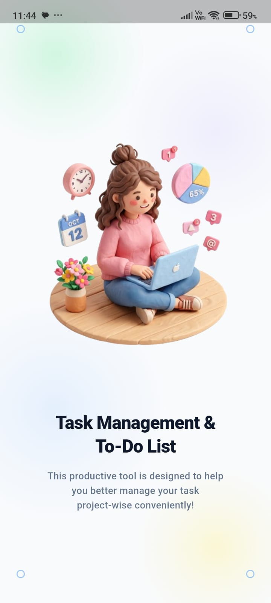
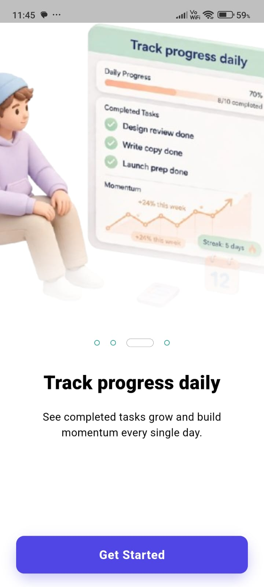
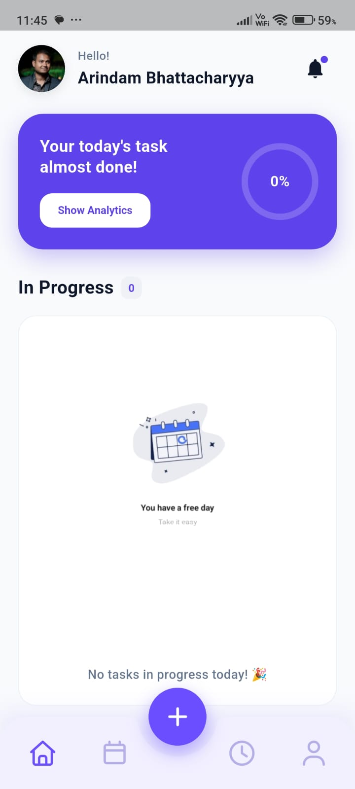
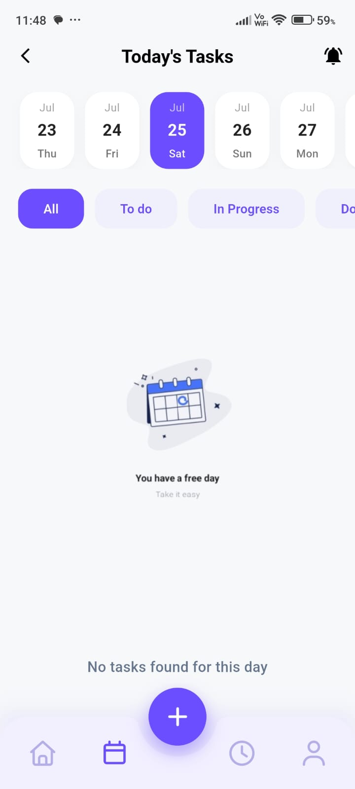
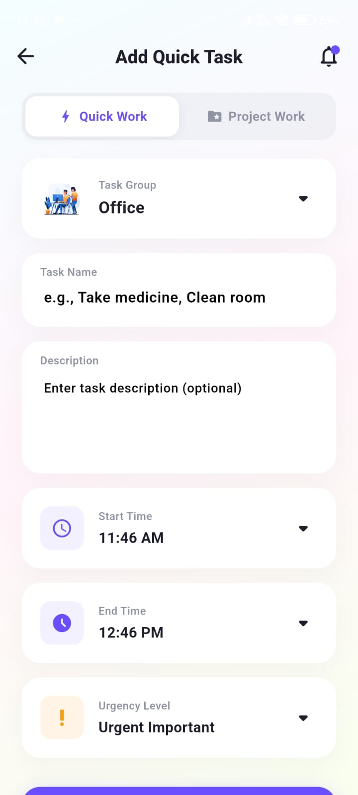
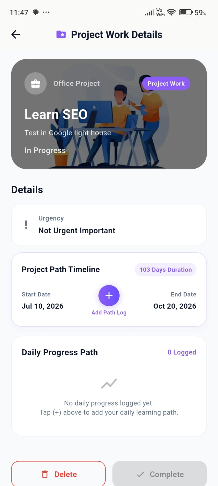
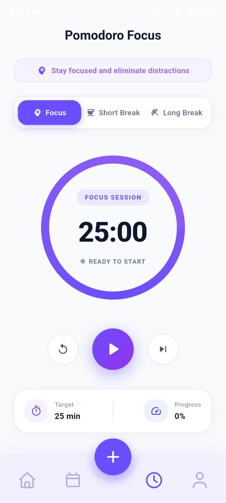

# 📍 Context-Aware To-Do App with Geofencing

[](https://flutter.dev/)
[](https://www.sqlite.org/)
[](https://firebase.google.com/)


> An **intelligent, location-aware, and context-driven personal productivity engine** built with Flutter. Designed to surpass traditional static to-do lists by surfacing the right tasks at the right time and location.

---

## 📱 Application Demo

<p align="center">
  
  
  
</p>
<p align="center">
  
  
  
</p>
<p align="center">
  
</p>

## 💡 Core Philosophy

Traditional task managers overload users with static lists of unorganized to-dos regardless of time, place, or mental state. This project operates on a dynamic context equation:

$$\text{Actionable Task} = \text{Current Location (Geofencing)} + \text{Time and Urgency} + \text{User Focus State}$$

By integrating **location geofencing**, **biometric security**, **focus timers**, and **offline-first persistence**, the app adapts to your day rather than requiring you to adapt to it.

---

## ✨ Features Breakdown

### 📍 1. Geofencing & Location Awareness
* **Geofenced Task Filtering**: Automatically detects when you enter predefined locations (e.g., Office, Home, Gym) and surfaces location-relevant tasks.
* **Proximity Alerts**: Trigger timely notifications when arriving at or leaving specific task-anchored places.
* **Contextual Tagging**: Tag tasks with location coordinates or radius boundaries to keep work context-specific.

### ⏱️ 2. Integrated Pomodoro Focus Engine
* **Deep Work Timers**: Built-in customizable Pomodoro sessions (Focus, Short Break, Long Break).
* **Local Notification Sync**: Schedules high-priority system alerts via `flutter_local_notifications` so focus intervals are honored even when the app is minimized or the screen is off.
* **Cubit State Management**: Real-time timer state tracking with pause, reset, and skip capabilities.

### 🔐 3. Encrypted Biometric Vault
* **Private Tasks & Documents**: Dedicated secure vault for sensitive tasks, personal notes, and confidential files.
* **Hardware Biometrics**: Authenticate via fingerprint or Face ID using `local_auth`.
* **Encrypted Storage**: Secure credentials and tokens backed by `flutter_secure_storage` and cryptographic hashing (`crypto`).

### ⚡ 4. Dual Task Scheduling ("Quick Work" vs. "Project Work")
* **Quick Work**: Time-based micro-tasks designed for fast execution during short gaps in your day.
* **Project Work**: Deadline-driven, multi-step milestones with explicit due dates, urgency ratings, and completion locks for overdue items.
* **Lifecycle States**: Clear task progression: `Planned` ➔ `Active` ➔ `Snoozed` ➔ `Completed` ➔ `Archived`.

### 💾 5. Offline-First SQLite Architecture
* **Fast Local Database**: Uses `sqflite` relational caching (`todo_cache.db`) for immediate load times and zero network latency.
* **Seamless Connectivity Monitoring**: Integrates `connectivity_plus` to listen for network state changes and notify users of offline operation.

### 🔔 6. Smart Notifications & Background Tasks
* **Local & Cloud Notifications**: Integrated background alerts powered by `awesome_notifications` / `flutter_local_notifications` and `firebase_messaging`.
* **Background Execution**: Background worker integration via `workmanager` for scheduled task checks and weather/location updates.

---

## 🛠️ Technology Stack

| Domain | Technology / Library | Purpose |
|---|---|---|
| **Framework** | Flutter (Dart SDK ^3.7.2) | Cross-platform mobile development |
| **State Management** | `flutter_bloc` | Predictable state flow with Cubits & Blocs |
| **Local Database** | `sqflite`, `path` | Relational SQLite persistence (`todo_cache.db`) |
| **Secure Storage** | `flutter_secure_storage` | Encrypted key-value store for secrets |
| **Biometrics** | `local_auth` | Fingerprint & Face ID authentication |
| **Routing** | `go_router` | Declarative routing & navigation guards |
| **Notifications** | `flutter_local_notifications` | Scheduled local & background notifications |
| **Background Tasks**| `workmanager` | Periodic background execution on Android |
| **Network Monitor** | `connectivity_plus` | Real-time network connectivity listening |
| **Cloud Service** | `firebase_core`, `firebase_auth` | Authentication & backend services |
| **Styling & Icons** | `google_fonts`, `font_awesome_flutter` | Modern typography & iconography |

---

## 🗄️ Database Schema (`tasks` table)

The SQLite database (`todo_cache.db`) uses the following schema:

```sql
CREATE TABLE tasks (
  id TEXT PRIMARY KEY,
  is_pending INTEGER NOT NULL,
  urgency_level TEXT NOT NULL,
  category TEXT NOT NULL,
  name TEXT NOT NULL,
  description TEXT NOT NULL DEFAULT '',
  start_time TEXT NOT NULL,
  end_time TEXT NOT NULL DEFAULT ''
);
```

---

## 🚀 Getting Started

### Prerequisites

* [Flutter SDK](https://docs.flutter.dev/get-started/install) (v3.27+ recommended)
* Android Studio / VS Code with Flutter extension

* Android Device or Emulator (API Level 24+ recommended for Geofencing & Biometrics)

### Installation

1. **Clone the repository:**
   ```bash
   git clone https://github.com/ArindamBhatta/todo_app.git
   cd todo_app
   ```

2. **Install dependencies:**
   ```bash
   flutter pub get
   ```

3. **Set up Firebase configuration:**
   * Place your `google-services.json` file inside `android/app/`.

4. **Run the application:**
   ```bash
   flutter run
   ```

---

## 📱 Required App Permissions

To fully utilize context-aware features, ensure the following permissions are configured:

* **Location (`ACCESS_FINE_LOCATION`, `ACCESS_COARSE_LOCATION`)**: Required for geofenced task triggers.

* **Notifications (`POST_NOTIFICATIONS`)**: Required on Android 13+ (API 33+) for Pomodoro and deadline alerts.

* **Biometrics (`USE_BIOMETRIC`, `USE_FINGERPRINT`)**: Required to unlock the Encrypted Vault.

---


