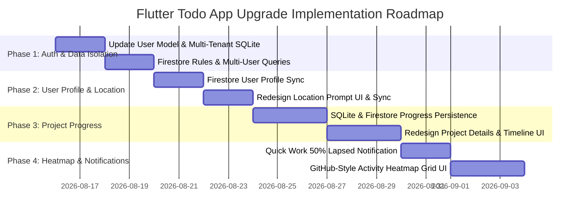

# Technical Specification & App Flow Gap Analysis

**Project**: Smart Todo & Project Progress Flutter Application  
**Document Type**: Architectural Specification, Flow Audit & Implementation Plan  
**Target File**: `doc/specification.md`  
**Date**: August 15, 2026  
**Role**: Senior Flutter & Backend Architect  

---

## 1. Executive Summary & App Flow Gap Analysis

After performing a complete structural audit of the Flutter Todo application codebase (`lib/core`, `lib/features`), we identified several operational, data isolation, and user experience gaps. Below is the comprehensive breakdown of identified **app flow gaps**.

> ### 🚨 Critical App Flow Gaps Identified
>
> 1. **[Authentication & Multi-Tenant Task Scoping Deficit]**: **Tasks and SQLite/Firestore entities are currently saved globally without binding to an authenticated User UUID or Email. When multiple users sign up or switch accounts in the app, user A can view, edit, or overwrite user B's tasks because the Firestore `/tasks` collection and local SQLite `tasks` table lack a mandatory `user_id` column/field.**
>
> 2. **[User Profile Sync & Storage Gap]**: **Google Sign-In authentication succeeds via `GoogleAuthService`, but user metadata (Name, Email, Profile Picture URL, UUID, Last Login, Home/Office Coordinates) is never saved or updated in Cloud Firestore under a `/users/{userId}` document schema. The app lacks user persistence in the cloud database.**
>
> 3. **[Profile Page Placeholder Deficit]**: **The Profile Page (`lib/features/Profile/profile.dart`) is currently a blank placeholder (`Center(child: Text('Profile Page'))`) lacking user identity details, completed task statistics, and the GitHub-style 365-day Activity Contribution Heatmap for Quick and Project Work.**
>
> 4. **[Quick Work 50% Lapsed Local Notification Scheduling Gap]**: **The `NotificationService` currently supports instant alerts and Pomodoro timers, but lacks scheduled background triggers for Quick Work tasks when 50% of the allocated time window elapses ("Your 50% time is lapsed. You have 50% time in your hand.") when the app is in the background or terminated.**
>
> 5. **[Project Work Daily Progress Memory Volatility Gap]**: **In `ProjectWorkDetailsPage`, daily progress entries (`_progressLogs`) are stored exclusively in in-memory state (`List<Map<String, String>>`). When the user leaves the details page or restarts the app, all logged daily updates are lost permanently because SQLite has no `project_progress` table and Firestore has no `progress_logs` subcollection.**
>
> 6. **[Project Work UI/UX & Daily Progress Update Flow Deficit]**: **The current daily progress UI relies on a raw popup dialog without date locking, streak counters, percentage progress sliders, or milestone path nodes. Users cannot edit prior logs, visualize progress curves, or track daily check-in habits.**
>
> 7. **[Intrusive Location Prompt UI & Missing Cloud Storage Gap]**: **The app proactively prompts for location permissions using raw, blocking system `AlertDialog` dialogs sequentially on the Home Screen upon launch, leading to a jarring user experience. Additionally, latitude and longitude coordinates are saved only in local SQLite (`locations` table) and never synced to Cloud Firestore.**

---

## 2. Detailed Technical Specifications & Task Solutions

---

### Task 1: GitHub-like Activity Grid on Profile Page & 50% Lapsed Notifications

#### A. GitHub-Style Activity Contribution Heatmap (Profile Page)

##### 1. Overview & UI/UX Design
The Profile Page will feature a **GitHub-style Activity Grid** (Contribution Heatmap) displaying daily user activity over the past 52 weeks (or last 90/365 days).
* **Tracked Activity**:
  * **Quick Work**: Increments count when a task is completed (`is_pending == 0`).
  * **Project Work**: Increments count when a user posts a daily progress log entry or completes a project task.
* **Grid Layout**: 7 rows (Sunday to Saturday) $\times$ 52 columns (weeks).
* **Color Shading System**:
  * Level 0 (0 activities): `#EBEDF0` (Light Theme) / `#161B22` (Dark Theme)
  * Level 1 (1-2 activities): `#9BE9A8` (Soft Light Green)
  * Level 2 (3-4 activities): `#40C463` (Medium Green)
  * Level 3 (5-6 activities): `#30A14E` (Dark Green)
  * Level 4 (7+ activities): `#216E39` (Deep Emerald Green)

```
       Jan        Feb        Mar        Apr        May
Mon   [ ][1][ ][ ][2][ ][ ][ ][4][ ][ ][ ][1] ...
Wed   [ ][ ][1][ ][ ][3][ ][ ][ ][ ][2][ ][ ] ...
Fri   [ ][2][ ][ ][ ][ ][4][ ][ ][ ][ ][1][ ] ...
```

##### 2. Aggregation & Performance Data Model
* Daily activity records are stored in SQLite and aggregated locally to ensure instant offline rendering.
* **SQL Query for Heatmap Aggregation**:
```sql
SELECT 
  DATE(log_date) AS activity_date,
  COUNT(*) AS activity_count
FROM (
  SELECT end_time AS log_date FROM tasks WHERE is_pending = 0 AND user_id = ?
  UNION ALL
  SELECT log_date FROM project_progress WHERE user_id = ?
)
GROUP BY DATE(log_date);
```

---

#### B. Quick Work 50% Time Lapsed Local Notification Engine

##### 1. Trigger Calculation Logic
When creating or editing a task with `task_type == 'quick'`:
* Total Time Window ($T$): $T = \text{endTime} - \text{startTime}$
* Lapsed Midpoint ($M$): $M = \text{startTime} + \frac{T}{2}$
* Current Time ($N$): $N = \text{DateTime.now()}$

##### 2. Notification Rules & Handling
* **Condition 1**: If $N < M$, schedule exact local notification at time $M$.
* **Condition 2**: If $N \ge M$ and $N < \text{endTime}$, fire an immediate alert if not previously triggered.
* **Condition 3**: If task is marked complete or deleted, cancel scheduled notification by task `id.hashCode`.

##### 3. Local Notification Details
* **Channel ID**: `quick_work_lapsed_channel`
* **Channel Name**: `Quick Work 50% Lapsed Alerts`
* **Importance**: `Importance.high`
* **Notification Title**: `⏳ Quick Work 50% Time Lapsed!`
* **Notification Body**: `Your 50% time for "${task.name}" has lapsed. You have 50% time left in your hand!`

```
+-------------------------------------------------------------+
| ⏳ Quick Work 50% Time Lapsed!                              |
| Your 50% time for "Design Wireframes" has lapsed.           |
| You have 50% time left in your hand!                        |
+-------------------------------------------------------------+
```

---

### Task 2: Project Work Daily Progress Persistence & UI/UX Redesign

#### A. Data Persistence Architecture (SQLite + Cloud Firestore Sync)

To fix the memory volatility bug where `_progressLogs` are lost on widget dispose, we introduce local SQLite caching with background Firestore sync.

##### 1. Local SQLite Schema Migration (New Table `project_progress`)
```sql
CREATE TABLE project_progress (
  id TEXT PRIMARY KEY,
  task_id TEXT NOT NULL,
  user_id TEXT NOT NULL,
  day_number INTEGER NOT NULL,
  topic TEXT NOT NULL,
  notes TEXT DEFAULT '',
  percentage_completed REAL DEFAULT 0.0,
  log_date TEXT NOT NULL,
  created_at TEXT NOT NULL,
  is_synced INTEGER DEFAULT 0,
  FOREIGN KEY (task_id) REFERENCES tasks (id) ON DELETE CASCADE
);
```

##### 2. Cloud Firestore Subcollection Schema
* **Document Path**: `/tasks/{taskId}/progress_logs/{logId}`
```json
{
  "id": "log_uuid_123",
  "task_id": "task_uuid_456",
  "user_id": "user_uid_789",
  "day_number": 1,
  "topic": "Setup Flutter Architecture & State Management",
  "notes": "Configured GoRouter and MultiBlocProvider for Auth and Todo",
  "percentage_completed": 25.0,
  "log_date": "2026-08-15T10:00:00.000Z",
  "created_at": "2026-08-15T10:00:00.000Z"
}
```

---

#### B. User Experience (UX) & Interface (UI) Redesign

##### 1. Interactive Timeline & Progress Path Widget
Replace basic static lists with an animated **Daily Progress Timeline**:
* **Visual Milestone Nodes**: Each day is represented as a connected path node.
  * 🟢 **Completed Days**: Green node with checkmark + topic summary.
  * 🔵 **Today's Active Day**: Glowing pulse node with active `(+) Update Progress` CTA.
  * ⚪ **Future Days**: Dotted connector node indicating target end date.
* **Streak & Consistency Badge**: Top hero card displaying continuous daily check-ins (e.g., `🔥 5-Day Work Streak`).

##### 2. Redesigned Daily Progress Sheet Modal
* **Percentage Slider**: Interactive slider (0% to 100%) showing total project completion boost.
* **Date Locking**: Auto-detects current date; allows updating previous missed days with back-dated entries.
* **Markdown & Notes Editor**: Multi-line rich input for code snippets, key learnings, and blockers.

---

### Task 3: Cloud Firestore DB Design for Multi-User Support

#### A. Multi-Tenant Data Isolation Strategy
To support multiple users without data leakage, every record written to Firestore and SQLite MUST include the authenticated user's `user_id` (Firebase Auth `uid`) and `user_email`.

#### B. Cloud Firestore Schema Structure

##### Collection: `/tasks`
* **Document ID**: `taskId` (UUID v4)
* **Fields**:
  * `id`: `string`
  * `user_id`: `string` (Firebase Auth UID — Mandatory Index)
  * `user_email`: `string`
  * `name`: `string`
  * `description`: `string`
  * `category`: `string` (`Office`, `Health`, `Finance`, `Home`, `Personal`, `Career`, `Self`, `Leisure`, `Fun`)
  * `urgency_level`: `string` (`Urgent Important`, `Not Urgent Important`, `Not Important Urgent`, `Not Important Not Urgent`)
  * `task_type`: `string` (`quick` | `project`)
  * `is_pending`: `boolean`
  * `start_time`: `timestamp` / `ISO8601 string`
  * `end_time`: `timestamp` / `ISO8601 string`
  * `created_at`: `timestamp`
  * `updated_at`: `timestamp`

#### C. Cloud Firestore Security Rules Blueprint
```javascript
rules_version = '2';
service cloud.firestore {
  match /databases/{database}/documents {
    
    // User profile access control
    match /users/{userId} {
      allow read, write: if request.auth != null && request.auth.uid == userId;
    }
    
    // Multi-tenant task access control
    match /tasks/{taskId} {
      allow read, update, delete: if request.auth != null && resource.data.user_id == request.auth.uid;
      allow create: if request.auth != null && request.resource.data.user_id == request.auth.uid;
      
      // Progress logs subcollection access control
      match /progress_logs/{logId} {
        allow read, write: if request.auth != null && request.auth.uid == request.resource.data.user_id;
      }
    }
  }
}
```

#### D. Local SQLite Schema Version 2 Upgrade
Modify `TodoDatabase` `_initDb()` to migration version 2:
```sql
ALTER TABLE tasks ADD COLUMN user_id TEXT NOT NULL DEFAULT '';
ALTER TABLE tasks ADD COLUMN user_email TEXT DEFAULT '';
```

---

### Task 4: User Information Storage in Cloud Firestore

#### A. Document Schema Structure
Upon user login (Google Sign-In, Email/Password, or Session Restore), the app writes/updates user information in Cloud Firestore.

* **Document Path**: `/users/{userId}`
```json
{
  "uuid": "firebase_auth_uid_123456",
  "name": "Arindam Bhatta",
  "email": "arindam@example.com",
  "profile_picture": "https://lh3.googleusercontent.com/a/ACg8oc...",
  "created_at": "2026-08-15T09:54:41.000Z",
  "last_login": "2026-08-15T09:54:41.000Z",
  "home_location": {
    "latitude": 22.5726,
    "longitude": 88.3639,
    "updated_at": "2026-08-15T09:54:41.000Z"
  },
  "office_location": {
    "latitude": 22.5800,
    "longitude": 88.4344,
    "updated_at": "2026-08-15T09:54:41.000Z"
  },
  "current_location": {
    "latitude": 22.5726,
    "longitude": 88.3639,
    "updated_at": "2026-08-15T09:54:41.000Z"
  }
}
```

#### B. Auth Integration Lifecycle Sync
Update `AuthCubit` and `FirestoreService`:
1. When `signInWithGoogle()` succeeds, fetch Firebase `User`.
2. Construct `UserModel` with `uuid`, `displayName`, `email`, `photoUrl`.
3. Call `FirestoreService.instance.saveUserProfile(userModel)`.

---

### Task 7: Location Tracker UI/UX Redesign & Firestore Sync

#### A. UI/UX Prompt Elevation (Bottom Sheet Modal)

##### 1. Problem with Current Implementation
The current app displays standard modal popups (`AlertDialog`) directly inside `_checkLocationAndPrompt()` during screen render. It prompts "Is this your home?" followed by "Is this your office?", creating a repetitive and intrusive experience.

##### 2. Proposed UI Design Solution (`LocationSetupBottomSheet`)
Replace native alert dialogs with a modern, glassmorphic **Location Setup Bottom Sheet**:
* **Visual Icon & Illustration**: Map pin icon with ripple effect.
* **Informative Context**: Displays current address / geocoded landmark name (e.g. *"Detected near Sector V, Kolkata"*).
* **Action Grid**:
  * 🏠 `Set as Home`
  * 🏢 `Set as Office`
  * ⏰ `Remind Me Later`
  * ✖ `Skip for Now`
* **Non-Blocking Trigger**: Show as a subtle top snackbar banner or floating action chip on HomeScreen rather than blocking user interaction on app boot.

```
+-------------------------------------------------------------+
| 📍 Personalize Your Task Context                             |
|                                                             |
| We detected a new location near Sector V, Salt Lake.        |
| Tag this location to auto-filter your Home & Office tasks.  |
|                                                             |
|  [ 🏠 Set as Home ]      [ 🏢 Set as Office ]               |
|                                                             |
|           [ Remind Later ]      [ Skip ]                    |
+-------------------------------------------------------------+
```

#### B. Firestore Location Persistence Workflow
When the user sets Home or Office location:
1. Save locally in SQLite `locations` table.
2. Push coordinates to Firestore document `/users/{userId}` under `home_location` or `office_location`.
3. Update `current_location` map field in Firestore whenever position updates.

---

## 3. Comprehensive Database Schema Matrix

| Database | Entity / Table | Key Fields | Purpose | Sync Status |
| :--- | :--- | :--- | :--- | :--- |
| **SQLite** | `tasks` | `id`, `user_id`, `name`, `category`, `urgency_level`, `task_type`, `is_pending`, `start_time`, `end_time`, `is_synced` | Local task caching & offline-first capability | Syncs to Firestore `/tasks/{id}` |
| **SQLite** | `project_progress` | `id`, `task_id`, `user_id`, `day_number`, `topic`, `notes`, `percentage_completed`, `log_date`, `is_synced` | Persistent daily updates for project work | Syncs to `/tasks/{id}/progress_logs/{logId}` |
| **SQLite** | `locations` | `category` (Home/Office), `latitude`, `longitude` | Fast offline geofencing matching | Syncs to `/users/{id}` |
| **Firestore** | `/users/{userId}` | `uuid`, `name`, `email`, `profile_picture`, `home_location`, `office_location`, `current_location` | Global user identity & location storage | Primary Source of User Profile |
| **Firestore** | `/tasks/{taskId}` | `id`, `user_id`, `user_email`, `name`, `description`, `category`, `urgency_level`, `task_type`, `is_pending` | Cloud storage for multi-device sync | Primary Task Store |
| **Firestore** | `/tasks/{id}/progress_logs` | `id`, `task_id`, `user_id`, `day_number`, `topic`, `notes`, `percentage_completed`, `log_date` | Subcollection for daily project progress | Primary Project Log Store |

---

## 4. Implementation Roadmap & Phased Execution



### Phase 1: Authentication & Multi-Tenant Data Isolation
- Add `uid` and `email` to `UserModel`.
- Upgrade SQLite schema (`tasks` table version 2) with `user_id` and `user_email`.
- Update `FirestoreService` to query `/tasks` filtered by `where('user_id', isEqualTo: currentUserId)`.
- Deploy Cloud Firestore Security Rules.

### Phase 2: User Profile Sync & Location UX Redesign
- Implement `FirestoreService.upsertUserProfile()` to write user metadata on auth events.
- Create `LocationSetupBottomSheet` widget replacing raw `AlertDialog` popups.
- Save location coordinates to Firestore `/users/{userId}`.

### Phase 3: Project Work Daily Progress Persistence & Timeline UX
- Create SQLite `project_progress` table and DAO methods.
- Build Firestore subcollection sync for `/tasks/{taskId}/progress_logs`.
- Redesign `ProjectWorkDetailsPage` with daily milestone path nodes, percentage sliders, and streak counters.

### Phase 4: Quick Work Notifications & GitHub Activity Grid
- Update `NotificationService` to calculate 50% lapsed midpoint duration and schedule exact alerts.
- Build `GitHubActivityHeatmap` custom widget on `ProfilePage` rendering 365-day contribution matrix.
- Connect activity grid to combined task completion & daily progress log queries.